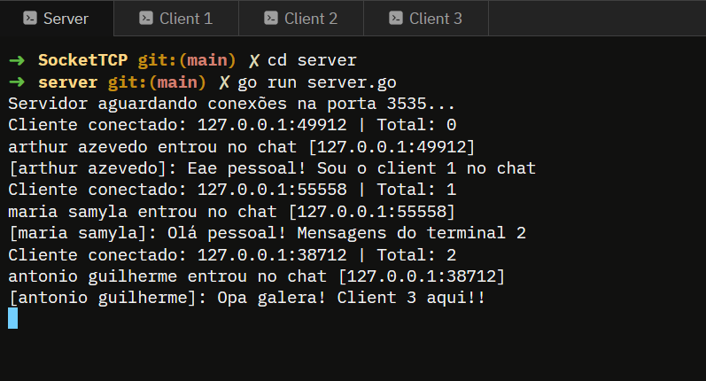
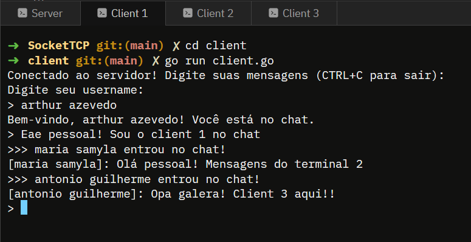

# Projeto SocketTCP

> Chat em tempo real via socket TCP, permitindo comunicação entre
> múltiplos clientes simultaneamente com identificação por username.

## Sobre o Projeto

Construído com Go (Golang) como stack base, aproveitando sua
simplicidade, eficiência e suporte nativo à concorrência via goroutines.

### Funcionalidades
- Comunicação em tempo real entre múltiplos clientes
- Identificação por username definido pelo próprio cliente
- Notificações de entrada e saída de usuários no chat
- Servidor registra todas as mensagens como log

## Pacotes Utilizados

### `servidor/server.go`
- `bufio` - Leitura linha por linha das mensagens recebidas via conexão
- `net` - Abertura da porta TCP 3535, aceite de conexões e envio de dados
- `fmt` - Formatação e exibição das mensagens no log do servidor
- `sync` - Mutex para proteger o mapa de clientes contra race conditions

### `cliente/client.go`
- `bufio` - Leitura do teclado (os.Stdin) e das mensagens recebidas
- `net` - Conexão TCP com o servidor via net.Dial
- `fmt` - Exibição de mensagens e envio formatado ao servidor
- `os` - Acesso ao teclado via os.Stdin e encerramento via os.Exit

## Requisitos

- Go versão 1.18 ou superior
- Compatível com Windows (CMD/PowerShell/WSL), Linux, macOS e Android (Termux)

## Como Executar

### 1. Clone o repositório
```bash
git clone https://github.com/seu-usuario/SocketTCP.git
cd SocketTCP
```

### 2. Inicialize os módulos
```bash
cd servidor && go mod init servidor && cd ..
cd cliente && go mod init cliente && cd ..
```

### 3. Execute o servidor (Terminal 1)
```bash
cd servidor
go run server.go
```

### 4. Execute o cliente (Terminal 2)
```bash
cd cliente
go run client.go
```

### 5. Abra quantos terminais de cliente desejar e repita o passo 4

## Demonstração

> Imagens de como é o output no `server.go`


---
> Imagens de como é o output no `client.go`


## Estrutura do Projeto

```
SocketTCP/
├── servidor/
│   ├── go.mod
│   └── server.go
└── cliente/
    ├── go.mod
    └── client.go
```